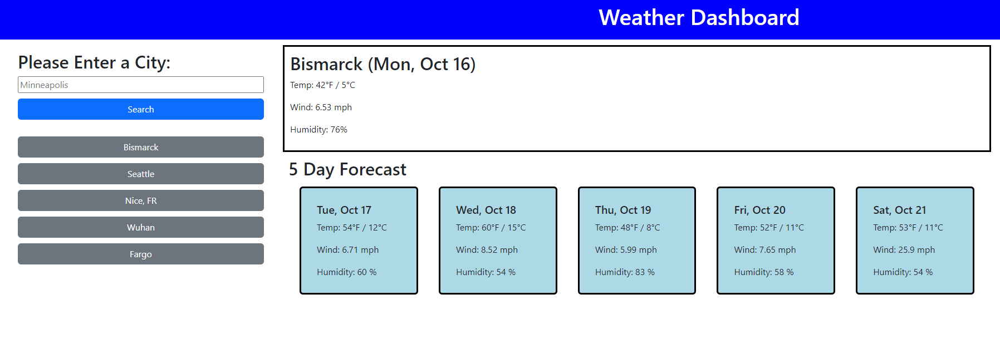

# Weather Forecast App

## Description

This fun project allows you to lookup any major city and see the current and future weather conditions in that city. It was built using HTML, CSS, and JavaScript with the help of Bootstrap and jQuery. This project really helped me become more comfortable using Bootstrap, and also worked to strengthen my skills using both vanilla JS and jQuery.

## Usage

To use this webpage, all the user has to do is type the name of a desired city into the search bar. When the 'Search' button is clicked, the user will be presented with the current weather in the city, as well as a 5 day forecast for future weather in that city. The city will then be added to the "Quick History" section, where the user can see their 5 most recent searches, and can click on the previous searches to bring that city's weather back onto the screen.

This project can be accessed by going to [this link.](https://timpyjoe.github.io/weather-webpage/)
Below is a screenshot of what the webpage might look like while it's being used. 